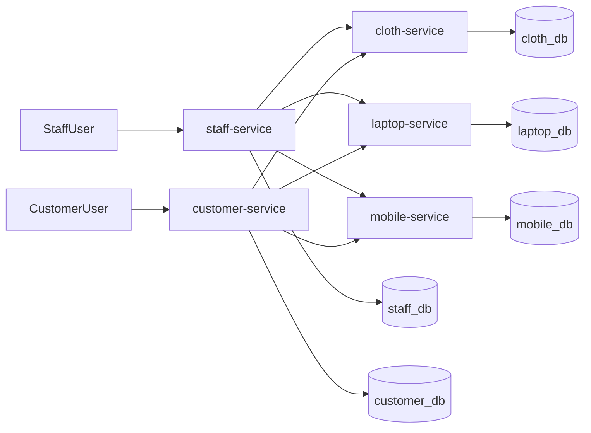

# E-Commerce Microservice Architecture

## Final Architecture

The system uses five Django microservices with one PostgreSQL database per
service:

- `staff-service`
- `customer-service`
- `cloth-service`
- `laptop-service`
- `mobile-service`

The project intentionally does not introduce an API gateway, order-service, or
payment-service in v1. This keeps the architecture understandable while still
respecting service boundaries.

## Why This Fits The Requirements

- Separate authentication flows for customers and staff remain explicit.
- Product services stay isolated by domain and ownership.
- Customer cart supports cross-service items using soft references.
- Checkout remains simple by using synchronous REST orchestration in
  `customer-service`.
- Each service owns its own database and never performs cross-service joins.

## Service Responsibilities

### `staff-service`

- Register and authenticate staff users
- Issue JWTs with `user_type=staff`
- Expose profile endpoint
- Carry role/permission information for product management

### `customer-service`

- Register and authenticate customers
- Issue JWTs with `user_type=customer`
- Expose customer profile endpoint
- Own cart, cart items, orders, and order items
- Orchestrate checkout

### Product Services

Each product service owns its own catalog and stock:

- `cloth-service`: clothing products and categories
- `laptop-service`: laptop products, categories, and brands
- `mobile-service`: mobile products, categories, and brands

## Data Ownership

- `staff-service` owns staff accounts only
- `customer-service` owns customer accounts, carts, and orders
- Each product service owns its own product catalog and stock

No service reads or writes another service's database.

## Authentication And Authorization

- JWTs are signed with a shared secret for local development simplicity
- Tokens include `sub`, `email`, `user_type`, `role`, `iss`, and `exp`
- Product mutation endpoints require a valid `staff` token
- Customer endpoints require a valid `customer` token
- Internal product stock endpoints require a service token

## Request Flows

### Staff Creates Product

1. Staff registers or logs in via `staff-service`
2. `staff-service` returns a JWT with `user_type=staff`
3. Staff calls a product service create endpoint
4. Product service validates token and stores the product in its own database

### Customer Adds Product To Cart

1. Customer logs in via `customer-service`
2. Customer submits product reference: service name + product ID
3. `customer-service` calls the target product service to verify the product
4. Cart item is stored with a soft reference and a price snapshot

### Customer Checkout

1. `customer-service` loads the customer's active cart
2. It groups items by product service
3. It revalidates product existence and stock via REST
4. It simulates payment success
5. It sends stock decrement requests to the relevant product services
6. It creates order and order item records
7. It clears the cart and returns a success response

## Trade-Offs

- Synchronous checkout is easier to debug than event-driven coordination
- Without a saga or message broker, distributed rollback is limited
- Shared JWT secret is acceptable for local development, but asymmetric keys
  would be better for a more advanced deployment

## Future Improvements

- Add API gateway for public routing and aggregation
- Split checkout into `order-service` and `payment-service`
- Move stock updates to event-driven workflows
- Add OpenAPI docs generation
- Add centralized logging and request tracing
