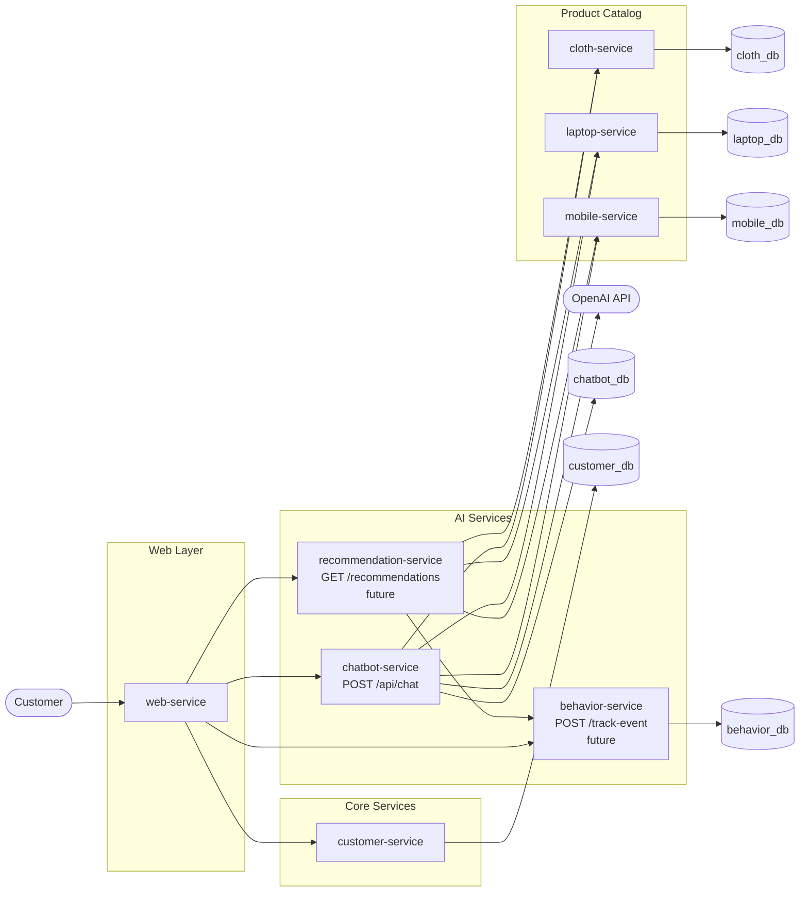
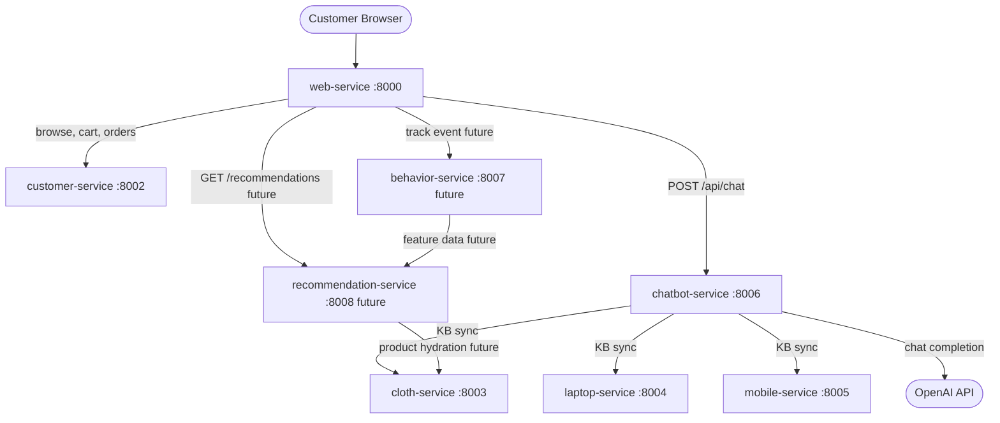

# AI Extension Architecture: Behavior Tracking, Recommendations & RAG Chatbot

> **Implementation scope for this iteration:** `chatbot-service` (fully coded).
> `behavior-service` and `recommendation-service` are designed in this document
> as the next phase but not yet coded.

---

## 1. AI Problem Definition

### What is "customer behavior analysis" in this system?

Customer behavior analysis means collecting and interpreting actions that
customers perform while using the e-commerce platform — specifically:

- Which products they view
- Which products they add to their cart
- Which products they actually purchase

By learning these patterns, the system can predict what a specific customer is
likely to want next and surface those products proactively.

### Business value

| Use case | Value |
|---|---|
| Personalized recommendations | Higher conversion rate |
| Related products on detail page | Increased average order value |
| Chatbot that understands catalog | Reduced support load, faster discovery |
| Customer segmentation | Targeted marketing |

### Inputs and outputs

**Inputs**
- `user_id` (from JWT)
- `product_id` and `product_service` (domain)
- Event type: `view`, `cart_add`, `purchase`
- Timestamp

**Outputs**
- Ranked list of recommended product IDs per user
- Chatbot answer grounded in live catalog + policy KB

### Mapping to existing microservices

```
customer-service  → source of user_id, cart events, order events
cloth-service     → catalog source for behavior events and KB
laptop-service    → catalog source for behavior events and KB
mobile-service    → catalog source for behavior events and KB
chatbot-service   → new service: KB + RAG → answer
behavior-service  → future: event store + feature pipeline
recommendation-service → future: model inference API
```

---

## 2. Data Design

### Data sources

| Service | Data available |
|---|---|
| `customer-service` | customer_id, cart contents, order history |
| `cloth-service` | product catalog, stock, category, size, material, color, gender |
| `laptop-service` | product catalog, stock, brand, cpu, ram, storage, display |
| `mobile-service` | product catalog, stock, brand, os, screen, battery, camera |

### Events to track

| Event | When | Data captured |
|---|---|---|
| `product_viewed` | Customer opens a product detail page | user_id, product_id, product_service, timestamp |
| `cart_added` | Customer calls `POST /api/cart/items` | user_id, product_id, product_service, quantity, timestamp |
| `purchased` | Checkout completes successfully | user_id, list of (product_id, product_service, quantity), timestamp |

### Behavior log schema (future `behavior-service`)

```sql
CREATE TABLE behavior_events (
    id          UUID PRIMARY KEY DEFAULT gen_random_uuid(),
    user_id     UUID NOT NULL,
    product_id  UUID NOT NULL,
    product_service VARCHAR(32) NOT NULL,  -- 'cloth', 'laptop', 'mobile'
    event_type  VARCHAR(32) NOT NULL,      -- 'view', 'cart_add', 'purchase'
    quantity    INTEGER DEFAULT 1,
    metadata    JSONB DEFAULT '{}',
    created_at  TIMESTAMPTZ NOT NULL DEFAULT now()
);

CREATE INDEX idx_behavior_user    ON behavior_events(user_id);
CREATE INDEX idx_behavior_product ON behavior_events(product_id, product_service);
CREATE INDEX idx_behavior_type    ON behavior_events(event_type, created_at);
```

### Proposed future `behavior-service`

A lightweight Django microservice that:
1. Receives `POST /track-event` from `customer-service` (or directly from
   a frontend client) whenever a tracked action occurs.
2. Stores events in its own PostgreSQL database.
3. Exposes aggregated feature queries for `recommendation-service`.

---

## 3. AI Use Cases

### 3.1 Product Recommendation

- **Input:** `user_id`
- **Output:** ordered list of `{product_id, product_service, score}` (top-N)
- **Logic:** compute similarity between user history and product catalog using
  collaborative filtering; fall back to popularity ranking for new users

### 3.2 Personalized Homepage

- **Input:** `user_id`, page position (slot index)
- **Output:** list of product references to display at the top of the home page
- **Logic:** call `recommendation-service`, hydrate product details from
  product services, render in the `web-service` template

### 3.3 Related Products on Detail Page

- **Input:** `product_id`, `product_service`
- **Output:** list of similar products (same domain or cross-domain)
- **Logic:** item-based collaborative filtering — users who viewed this item
  also viewed or purchased these other items

### 3.4 Next Purchase Prediction

- **Input:** `user_id`, recent behavior sequence
- **Output:** single most-likely next product category or product
- **Logic:** sequential model (LSTM or simple Markov chain) on behavior
  sequences; output is used to highlight a category on the homepage

### 3.5 Customer Segmentation (optional)

- **Input:** all customer behavior histories
- **Output:** cluster labels (e.g. "frequent buyer", "window shopper",
  "high-value tech buyer")
- **Logic:** K-Means or hierarchical clustering over aggregated feature vectors
  extracted from behavior logs; results inform marketing emails or discounts

---

## 4. AI Architecture

### Components

| Component | Responsibility | Status |
|---|---|---|
| `behavior-service` | event ingestion, feature store | **Design only — future phase** |
| `recommendation-service` | model training, inference API | **Design only — future phase** |
| `chatbot-service` | KB management, RAG, `/api/chat` | **Implemented in this iteration** |

### Architecture diagram



### Service communication

All inter-service calls are synchronous REST. The existing
`INTERNAL_SERVICE_TOKEN` header is used for service-to-service
authentication, matching the existing `customer-service → product-services`
pattern.

---

## 5. Model Design (Recommendation — Future Phase)

### Input format

```python
{
    "user_id": "uuid",
    "history": [
        {"product_id": "uuid", "product_service": "laptop", "event_type": "view", "timestamp": 1714000000},
        {"product_id": "uuid", "product_service": "laptop", "event_type": "cart_add", "timestamp": 1714001000},
    ]
}
```

### Output

```python
{
    "recommendations": [
        {"product_id": "uuid", "product_service": "laptop", "score": 0.92},
        {"product_id": "uuid", "product_service": "mobile", "score": 0.81},
    ]
}
```

### Simple model (recommended for student implementation)

**Collaborative Filtering (Matrix Factorization)**

1. Build a user-item matrix: rows = users, columns = products, values =
   weighted interaction count (`purchase=3`, `cart_add=2`, `view=1`).
2. Decompose with Truncated SVD (via `scikit-learn`):
   `U, S, Vt = TruncatedSVD(n_components=50).fit_transform(matrix)`
3. Predict ratings: `predicted = U @ diag(S) @ Vt`
4. For a given user, sort columns by predicted score and return top-N products
   with sufficient stock.

**Fallback for new users (cold start)**
- Return top products by overall `purchase + cart_add` count in the last 30 days.

### Optional deep learning extension

**Embedding + Dense model**

```
Input: [user_embedding(128) | product_embedding(128)]
       → Dense(256, relu)
       → Dropout(0.3)
       → Dense(128, relu)
       → Dense(1, sigmoid)   ← predicted interaction probability
```

**Sequential model (next-item prediction)**

```
Input: behavior sequence (variable length, each item = product embedding)
       → LSTM(128)
       → Dense(n_products, softmax)   ← probability over all products
```

### Training flow

```
1. Export behavior_events table to CSV or Parquet
2. Train model offline (Jupyter notebook or training script)
3. Serialize model: joblib.dump(model, 'model.pkl')
4. Load model in recommendation-service at startup
5. Expose GET /recommendations/{user_id} → runs inference, returns JSON
6. Retrain periodically (daily cron or manual trigger)
```

---

## 6. Knowledge Base Design

The chatbot KB is a hybrid of two sources:

### 6.1 Static documents (policies, FAQ)

Stored as seeded database records in `chatbot-service`.

Example entries:

```json
[
  {
    "title": "Return Policy",
    "content": "You can return any item within 30 days of purchase for a full refund. Items must be unused and in original packaging. To initiate a return, contact us at support@store.com."
  },
  {
    "title": "Shipping Policy",
    "content": "Standard shipping takes 3-5 business days. Express shipping takes 1-2 business days and costs an additional $9.99. Free standard shipping on orders over $50."
  },
  {
    "title": "Payment Methods",
    "content": "We accept Visa, Mastercard, PayPal, and bank transfers. Payment is processed securely at checkout."
  },
  {
    "title": "Warranty",
    "content": "Electronics carry a 12-month manufacturer warranty. Clothing items have a 90-day defect warranty."
  }
]
```

### 6.2 Dynamic product documents (synced from product services)

Ingested via a management command (`python manage.py sync_kb`) or an internal
endpoint `POST /api/internal/kb/sync`. Each product becomes a KB document:

```json
{
  "title": "Dell XPS 15 Laptop",
  "content": "Brand: Dell. CPU: Intel Core i7-13700H. RAM: 16 GB. Storage: 512 GB SSD. Display: 15.6 inch. Price: $1299.99. In stock: 8 units. Category: Ultrabooks. The Dell XPS 15 is a premium thin-and-light laptop with an OLED display and long battery life, suitable for creative professionals."
}
```

### 6.3 Data format (database models)

```
KnowledgeDocument
  id            UUID
  title         CharField(255)
  source_type   CharField  -- 'policy', 'faq', 'product'
  source_id     CharField  -- product UUID or slug for policy
  product_service CharField -- 'cloth' | 'laptop' | 'mobile' | ''
  updated_at    DateTimeField

KnowledgeChunk
  id            UUID
  document      FK → KnowledgeDocument
  chunk_index   IntegerField
  content       TextField
  embedding     JSONField (optional, stores OpenAI embedding vector)
  updated_at    DateTimeField

ChatConversation
  id            UUID
  user_id       UUID
  created_at    DateTimeField

ChatMessage
  id            UUID
  conversation  FK → ChatConversation
  role          CharField  -- 'user' | 'assistant'
  content       TextField
  citations     JSONField  -- list of KnowledgeChunk IDs used
  created_at    DateTimeField
```

---

## 7. RAG Chatbot Design

### Flow

```
1. Customer sends POST /api/chat with { question, conversation_id? }
2. chatbot-service authenticates the customer JWT
3. Retrieve top-K relevant chunks from KB:
   a. Tokenize question into keywords
   b. Score each chunk by keyword overlap (TF-IDF-like, no external dependency)
   c. Optionally: use OpenAI text-embedding-3-small for cosine similarity
4. Build context window:
   [System prompt] + [retrieved chunks] + [conversation history] + [question]
5. Call OpenAI chat completions (gpt-4o-mini)
6. Return { answer, citations, conversation_id }
7. Persist ChatMessage records for follow-up context
```

### Retrieval strategies

**Strategy A — Lexical (default, no API cost)**

Score each chunk against the question by counting shared meaningful tokens.
Simple to implement, no external dependency, sufficient for a focused KB.

**Strategy B — Embedding-based (env-flag: `USE_EMBEDDING_RETRIEVAL=1`)**

Call `openai.embeddings.create` once per chunk (during sync) and once per
question (at query time). Use cosine similarity to rank chunks. Requires
storing 1536-dimensional vectors in the `embedding` JSON column.

### System prompt template

```
You are a helpful shopping assistant for an e-commerce store that sells
clothing, laptops, and mobile phones.

Answer the customer's question using ONLY the information in the context
sections below. If the answer is not in the context, say so honestly.
Be concise and friendly.

Context:
{retrieved_chunks}
```

### Where it lives

`chatbot-service` — a new standalone Django REST microservice at port 8006
(default). It does **not** share a database with any other service and does
**not** inherit `shared.common.product_client` logic (it fetches products
only during KB sync, not during chat requests).

---

## 8. System Flows

### 8.1 User browses product → behavior tracking (future)

```
1. Customer opens product detail page in web-service
2. web-service renders the page and sends POST /track-event to behavior-service
   { user_id, product_id, product_service: "laptop", event_type: "view" }
3. behavior-service stores the event
```

### 8.2 User sees homepage → personalized recommendations (future)

```
1. Customer opens homepage
2. web-service calls GET /recommendations/{user_id} on recommendation-service
3. recommendation-service loads user features from behavior-service
4. Runs model inference → returns top-10 product references
5. web-service hydrates product details from product services
6. Renders personalized section on homepage
```

### 8.3 User adds to cart → behavior update (future)

```
1. Customer submits POST /api/cart/items to customer-service
2. customer-service validates and saves cart item
3. customer-service (or web-service) fires POST /track-event to behavior-service
   { user_id, product_id, product_service, event_type: "cart_add", quantity }
```

### 8.4 User checks out → purchase event (future)

```
1. customer-service completes checkout successfully
2. Fires one POST /track-event per order item to behavior-service
   { event_type: "purchase", ... }
3. behavior-service stores events, which update model training data
```

### 8.5 User asks chatbot → RAG flow (implemented)

```
1. Customer types a question in the chat widget on web-service
2. web-service forwards POST /api/chat { question, conversation_id? }
   with the customer's JWT Bearer token
3. chatbot-service validates JWT, loads conversation history
4. Retrieves top-K relevant chunks from KB
5. Builds context prompt and calls OpenAI gpt-4o-mini
6. Returns { answer, citations, conversation_id }
7. web-service renders the response in the chat widget
8. Customer can ask follow-up questions using the same conversation_id
```

---

## 9. API Design

### `chatbot-service`

#### `POST /api/chat`

- **Auth:** customer JWT (`Bearer <token>`)
- **Request:**

```json
{
  "question": "Do you have a laptop with 32GB RAM under $2000?",
  "conversation_id": "uuid-optional"
}
```

- **Response:**

```json
{
  "answer": "Yes, we currently carry the Dell XPS 15 with 32GB RAM at $1,799. It runs an Intel Core i7 CPU and has 1TB SSD storage. Would you like to add it to your cart?",
  "conversation_id": "f47ac10b-58cc-4372-a567-0e02b2c3d479",
  "citations": [
    {"chunk_id": "uuid", "document_title": "Dell XPS 15 Laptop", "snippet": "RAM: 32 GB. Price: $1799..."}
  ]
}
```

#### `POST /api/internal/kb/sync`

- **Auth:** internal service token (`X-Internal-Service-Token`)
- **Request:** `{}`
- **Response:**

```json
{
  "synced_documents": 47,
  "synced_chunks": 189,
  "duration_ms": 1230
}
```

### `behavior-service` (future)

#### `POST /track-event`

- **Auth:** internal service token
- **Request:**

```json
{
  "user_id": "uuid",
  "product_id": "uuid",
  "product_service": "laptop",
  "event_type": "view",
  "quantity": 1
}
```

- **Response:** `{ "ok": true }`

### `recommendation-service` (future)

#### `GET /recommendations/{user_id}`

- **Auth:** internal service token
- **Query params:** `?limit=10&exclude=cloth`
- **Response:**

```json
{
  "user_id": "uuid",
  "recommendations": [
    {"product_id": "uuid", "product_service": "laptop", "score": 0.92},
    {"product_id": "uuid", "product_service": "mobile", "score": 0.76}
  ]
}
```

---

## 10. Integration with Existing System

### How `customer-service` integrates (future behavior tracking)

After a successful cart add or checkout, `customer-service` makes a
fire-and-forget `POST /track-event` call to `behavior-service`:

```python
# In customer-service cart/checkout service layer
import requests
requests.post(
    settings.BEHAVIOR_SERVICE_URL + "/track-event",
    json={"user_id": str(user.id), "product_id": ..., "event_type": "cart_add"},
    headers={"X-Internal-Service-Token": settings.INTERNAL_SERVICE_TOKEN},
    timeout=2,
)
```

### How frontend gets recommendations (future)

`web-service` will call `recommendation-service` to populate the homepage
carousel:

```python
# In web-service, gateway client
class RecommendationGateway(BaseGatewayClient):
    def get(self, user_id):
        return self._request("get", f"{settings.RECOMMENDATION_SERVICE_URL}/recommendations/{user_id}")
```

### How chatbot is integrated (implemented)

`web-service` exposes a simple chat page that:
1. Submits the customer's question via AJAX or form POST to a Django view.
2. The view proxies the request (with the session JWT) to `chatbot-service`.
3. Renders the chatbot answer inline on the page.

The `ChatbotGateway` client follows the exact same pattern as the existing
`CustomerGateway` and `StaffGateway` in `web-service/apps/gateway/clients.py`.

---

## 11. Deployment (Docker)

### New services added to `docker-compose.yml`

```yaml
chatbot-service:
  build:
    context: ./services/chatbot-service
  container_name: chatbot-service
  env_file: .env
  environment:
    DJANGO_SETTINGS_MODULE: config.settings.local
    PYTHONUNBUFFERED: "1"
  volumes:
    - ./services/chatbot-service:/app
    - ./shared:/app/shared
  ports:
    - "${CHATBOT_SERVICE_PORT:-8006}:8000"
  depends_on:
    - chatbot-db

chatbot-db:
  image: postgres:16-alpine
  environment:
    POSTGRES_DB: ${CHATBOT_DB_NAME}
    POSTGRES_USER: ${CHATBOT_DB_USER}
    POSTGRES_PASSWORD: ${CHATBOT_DB_PASSWORD}
  ports:
    - "5438:5432"
  volumes:
    - chatbot_db_data:/var/lib/postgresql/data
```

### New env variables in `.env.example`

```
CHATBOT_SERVICE_PORT=8006

CHATBOT_DB_NAME=chatbot_db
CHATBOT_DB_USER=chatbot_user
CHATBOT_DB_PASSWORD=chatbot_password
CHATBOT_DB_HOST=chatbot-db
CHATBOT_DB_PORT=5432

OPENAI_API_KEY=sk-...
OPENAI_CHAT_MODEL=gpt-4o-mini
OPENAI_EMBEDDING_MODEL=text-embedding-3-small
USE_EMBEDDING_RETRIEVAL=0
```

### Startup after adding service

```bash
docker compose up --build chatbot-service chatbot-db
docker compose exec chatbot-service python manage.py migrate
docker compose exec chatbot-service python manage.py seed_kb
docker compose exec chatbot-service python manage.py sync_kb
```

---

## 12. Final Architecture Summary

### All services

| Service | Port | DB | Role |
|---|---|---|---|
| `web-service` | 8000 | SQLite | Browser-facing BFF |
| `staff-service` | 8001 | staff_db | Staff auth + product authority |
| `customer-service` | 8002 | customer_db | Customer auth, cart, orders |
| `cloth-service` | 8003 | cloth_db | Clothing catalog |
| `laptop-service` | 8004 | laptop_db | Laptop catalog |
| `mobile-service` | 8005 | mobile_db | Mobile catalog |
| `chatbot-service` | 8006 | chatbot_db | KB + RAG chatbot (implemented) |
| `behavior-service` | 8007 | behavior_db | Event tracking (future) |
| `recommendation-service` | 8008 | — | ML inference (future) |

### Full data flow (with AI)



### AI flow summary

1. **KB Build:** `chatbot-service` fetches live product data from the three
   catalog services and stores normalized KB documents and chunks in its own
   PostgreSQL database. Static FAQ and policy documents are seeded at startup.

2. **Chat Request:** The customer asks a question → chatbot retrieves the
   most relevant KB chunks (lexical scoring by default, embedding cosine
   similarity when `USE_EMBEDDING_RETRIEVAL=1`) → builds a system prompt
   containing the retrieved context → calls OpenAI gpt-4o-mini → returns
   the grounded answer with citations.

3. **Conversation continuity:** Each chat session has a `conversation_id`.
   Recent messages are included in the prompt window to allow multi-turn
   conversations.

4. **Future behavior loop:** Once `behavior-service` and
   `recommendation-service` are implemented, tracked events will flow into a
   collaborative filtering model that personalizes the homepage and product
   detail pages.
